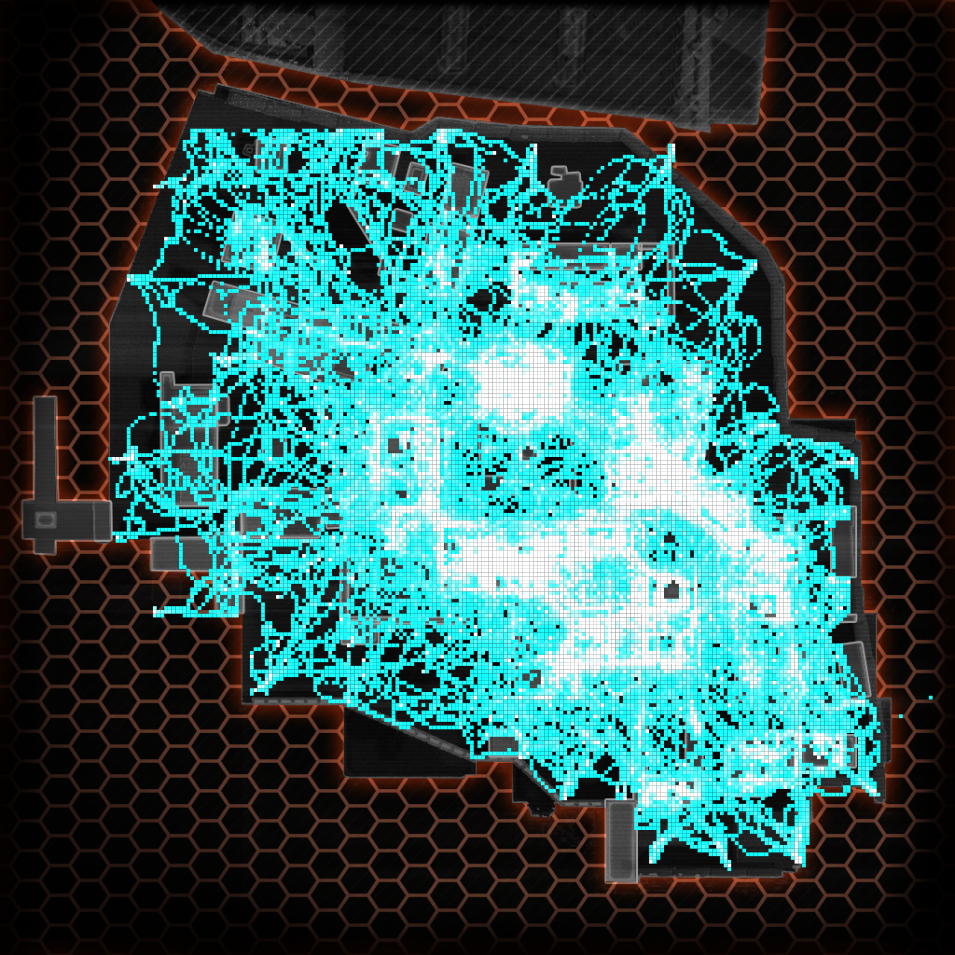
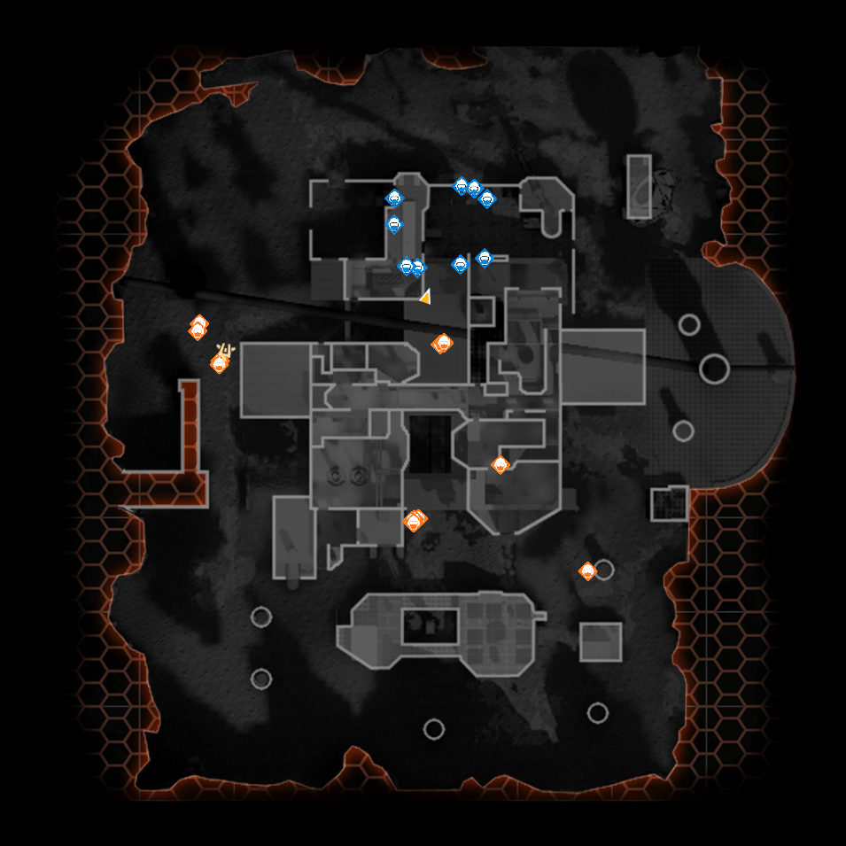

# Interstellar R2 Telemetry System

The R2 Telemetry System records player driven events inside a Titanfall 2 multiplayer match.

It is an extension of the [R2 Northstar Client](https://github.com/R2Northstar/Northstar) and currently uses a forked version of it.

## Current features

The system records most of the player / npc events during a match. 
These are the following features which are currently implemented into the system.

### Heatmaps

There are a lot of ways data can be represented on a heatmap. 
The current screenshot show the map Angle City and the routs the players have taken. 
The lighter the color the more often a player has traveled through there.

### Live Minimap

While playing there is a small minimap on the top left of the screen. But it only shows you a limited amount of infos.
This minimap is displayed inside the web-browser and show the entire map, all the players, the npc's and their types.

## Development

The R2 Telemetry System consists of different components:

1. [Forked NorthstarLauncher](https://github.com/Aragami-delp/NorthstarLauncherNamedPipeClient/tree/feature/namedpipe) (Named pipe client and modified Squirrel VM)
1. [Interstellar.Telemetry](./Interstellar.Telemetry/Readme.md) (Telemetry data aggregation inside the game engine. Built with Squirrel)
1. [C#NamedPipeServer](./CSNamedPipeServer/Readme.md) (Named Pipe Server is the middle man between Titanfall and the backend. Built with C#)
1. [DataEndpoint](./DataEndpoint/Readme.md) (Receives data from client forms the necessary computation and stores the data. Built with Java)
1. [DataFrontend](./DataFrontend) (The visualization. Built with react js)

